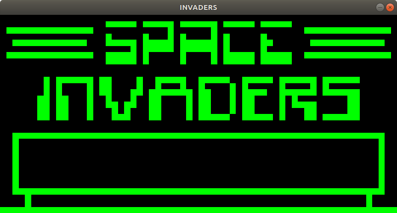
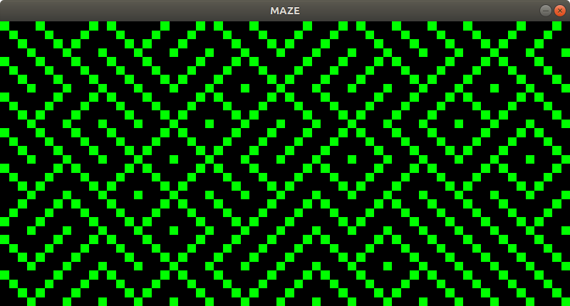
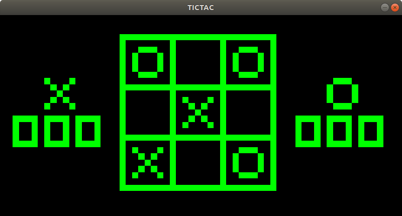
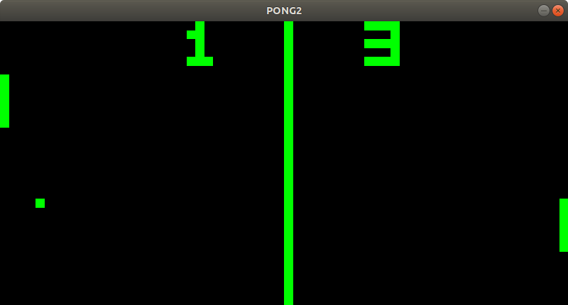
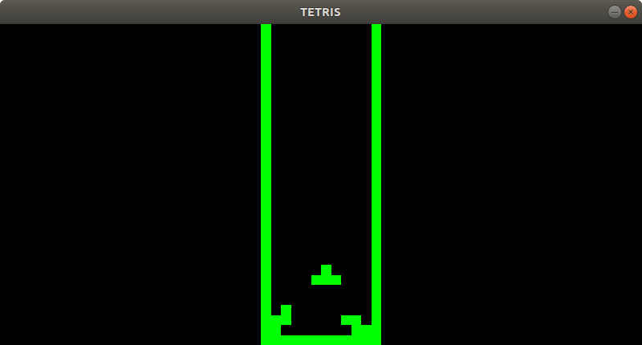
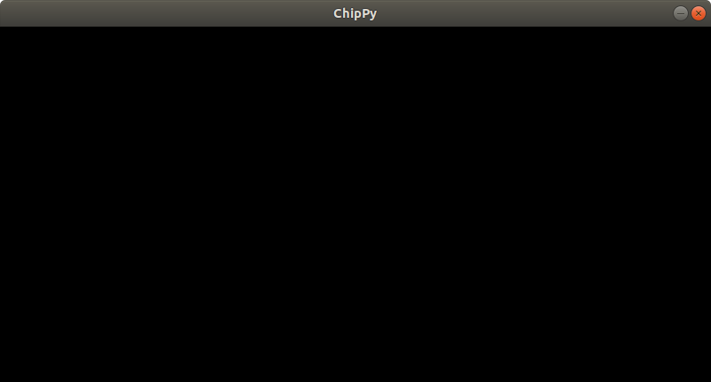

# ChipPy
A CHIP-8 emulator made in Python.

## Table of Contents
- [Description](#description)
- [Running Instructions](#running-instructions)
- [Screenshots](#screenshots)
  - [Space Invaders](#space-invaders)
  - [Maze](#maze)
  - [Tic-Tac-Toe](#tic-tac-toe)
  - [Pong](#pong)
  - [Tetris](#tetris)
  - [Base Emulator](#base-emulator)
- [Assorted Mental Notes](#assorted-mental-notes)
- [Controls](#controls)
  - [Original CHIP-8](#original-chip-8)
  - [Keyboard Mapping](#keyboard-mapping)
- [Games](#games)
- [Reference Material](#reference-material)

## Description
I got curious as to how emulation works, so to dive in and try it out before seeing techniques on how to improve, I decided to make a CHIP-8 emulator in Python!  I've heard that this is a good place to start as the hardware and instructions are simple so it's a great place to make mistakes and learn.  I also wanted to try out some other libraries so this seemed like a good excuse to take them out for a spin before going into greater depth there as well.  As this is my first time doing anything of the sort, and as it was just intended as a quick little side project for the sake of learning, there will be some silly choices and mistakes, but I hope that whoever's reading this has fun like I did and gets motivated to try it themself :)

I did try a few games and they seem to work and draw correctly, so for the most part this project is complete.  I will likely do some more manual testing to catch problems, add in more test cases, comments, and clean up some stuff here and there, but the core of it should be pretty decent in terms of functionality.

## Running Instructions
1. Install Python3 if you don't already have it.
2. Clone the project.
3. `cd` into the root directory of the project.
4. Create / activate any desired virtualenv.
5. `pip3 install -r requirements.txt`
6. `python3 src/emulator.py`

## Screenshots
### Space Invaders

### Maze

### Tic-Tac-Toe

### Pong

### Tetris

### Base Emulator

## Assorted Mental Notes
- I originally was avoiding using Numpy as it's a big dependence for such a small thing, but it ended up being necessary for sound and graphics.  I'd probably replace some other stuff with Numpy sections since the dependence is already there.
- I don't think I made a good choice using threads for the timers and opcode execution.  Manual timing may have been a better choice here as it would allow more to occur in the core loop and be more in control.  I'll look more into this before I make another emulator as I thought this part of what I did was pretty messy.
- I want to learn to use a native UI solution with python, as tkinter and easygui (which lives up to its name) aren't exactly the prettiest solutions.  I just needed something quick so they worked here, but that would definitely be something I'd change in the future.
- I want to find a better way to draw with pygame.  I've never tried it before and I got what I needed but I feel like my graphical solution could use work, and my sound solution was a bit of a nightmare to be honest.  I want to look into using straight SDL in the future (with C++ possibly) as a further learning experience.
- Going off the back of the last point, I do want to learn a better way to manage input as well.
- I saw varying values for clock speed so I'm not really sure what to put yet for the instruction execution.  I've set it to a fairly arbitrary value for now.
- Writing these tests was pretty useful, but I need to have a better idea in mind of what I want to test and how to test certain things (I kind of avoided tests for graphics, sound, timers, and randomness).
- Normally I wouldn't put everything in one file, but the CHIP-8 didn't seem to have enough moving parts to merit splitting it up, but I'd definitely want to do that in the future.  At time of writing, the main file is almost 1k lines long (not LOC).
- I haven't tried every single game, so apologies if some of them don't work.

## Controls
Aside from the actual game controls, you may close the window or press ESC to stop the emulator, and you may press L at any time to open the game picker window to load a new game.

When it comes to the game controls, I have put the mapping I used down below, but each game has it's own controls and I'm sad to say your guess is as good as mine there.

### Original CHIP-8
|     |     |     |     |
|:---:|:---:|:---:|:---:|
|  1  |  2  |  3  |  C  |
|  4  |  5  |  6  |  D  |
|  7  |  8  |  9  |  E  |
|  A  |  0  |  B  |  F  |

### Keyboard Mapping
|     |     |     |     |
|:---:|:---:|:---:|:---:|
|  1  |  2  |  3  |  4  |
|  Q  |  W  |  E  |  R  |
|  A  |  S  |  D  |  F  |
|  Z  |  X  |  C  |  V  |

## Games
I have included the public domain games which I could find in a directory in the project.  The file picker should automatically start inside there.  Have fun!

If I am mistaken and any games within are not a part of the public domain, please let me know and I will take them down immediately.

## Reference Material
I didn't want to look at any other implementations of CHIP-8 emulators as I'm doing this as a learning exercise and to get my feet wet when it comes to learning about emulation.  I didn't want any other implementations to influence mine and as such my implementation will be far from perfect and I'm looking forward to not making the same mistakes the next time I try making an emulator.

That being said, I naturally did look up how to do things specific to python and some libraries on StackOverflow and the like.
With regards to CHIP-8 itself, I did use reference material to learn about the hardware and opcodes, and I will list the main ones below.

[Wikipedia CHIP-8 Page](https://en.wikipedia.org/wiki/CHIP-8)  
[Cowgod's CHIP-8 Technical Reference](http://devernay.free.fr/hacks/chip8/C8TECH10.HTM)
